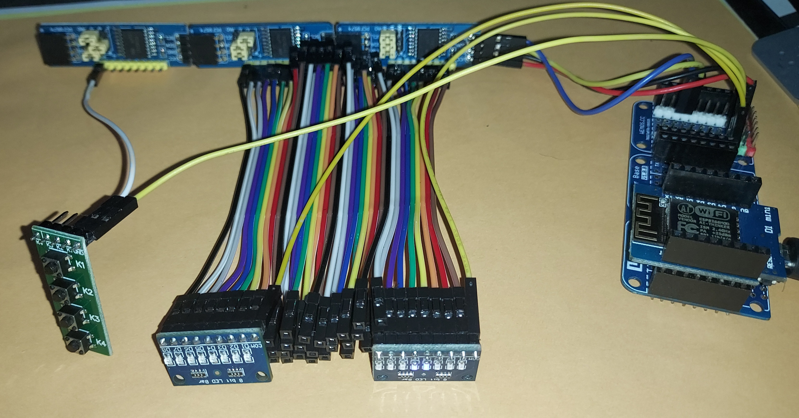

# MultiPCF8574

Librería Arduino / ESP8266 / ESP32 para controlar **múltiples módulos PCF8574 I²C** utilizando un sistema de **pines virtuales consecutivos**.

La librería permite trabajar con varios expansores PCF8574 como si todos sus GPIO fueran un único dispositivo con una numeración continua.

Por ejemplo, con 3 módulos:

```text
PCF8574 0x20 → pines virtuales  0 -  7
PCF8574 0x21 → pines virtuales  8 - 15
PCF8574 0x22 → pines virtuales 16 - 23
```

De esta forma, en lugar de gestionar individualmente cada PCF8574, podemos utilizar:

```cpp
io.digitalWrite(16, HIGH);
```

para controlar directamente el pin `P0` del módulo situado en `0x22`.

---

## Características

- Control de múltiples PCF8574 mediante I²C.
- Pines virtuales consecutivos.
- No depende de librerías externas de PCF8574.
- Utiliza directamente `Wire.h`.
- Compatible con Arduino, ESP8266 y ESP32.
- Detección de módulos durante `begin()`.
- Configuración mediante `pinMode()`.
- Escritura mediante `digitalWrite()`.
- Lectura mediante `digitalRead()`.
- Lectura de un módulo completo mediante `readByte()`.
- Escritura de un módulo completo mediante `writeByte()`.
- Consulta de las direcciones I²C.
- Consulta de módulos detectados.
- Permite utilizar una dirección I²C inicial diferente de `0x20`.

---

# Hardware

El PCF8574 es un expansor de entradas/salidas de 8 bits controlado mediante I²C.

Cada módulo proporciona:

```text
P0
P1
P2
P3
P4
P5
P6
P7
```

Por cada módulo se obtienen 8 pines adicionales.

El número máximo de módulos consecutivos soportado por esta librería es de **8**, correspondiente a las direcciones:

```text
0x20
0x21
0x22
0x23
0x24
0x25
0x26
0x27
```

Esto permite disponer de hasta:

```text
8 módulos × 8 pines = 64 pines virtuales
```

> Nota: las direcciones disponibles dependen de la variante de PCF8574 utilizada y de la configuración de sus pines de dirección A0/A1/A2.

---

# Instalación

## Arduino IDE

Descarga o clona este repositorio y copia la carpeta:

```text
MultiPCF8574
```

dentro de la carpeta:

```text
Arduino/libraries/
```

La estructura debe ser:

```text
Arduino/
└── libraries/
    └── MultiPCF8574/
        ├── src/
        │   ├── MultiPCF8574.h
        │   └── MultiPCF8574.cpp
        ├── examples/
        │   └── Basic/
        │       └── Basic.ino
        └── library.properties
```

Después reinicia Arduino IDE.

---

# Uso básico

Incluye la librería:

```cpp
#include <Wire.h>
#include <MultiPCF8574.h>
```

Crea un objeto indicando el número de módulos y la dirección inicial:

```cpp
MultiPCF8574 io(3, 0x20);
```

Esto configura:

```text
Módulo 0 → 0x20 → pines  0-7
Módulo 1 → 0x21 → pines  8-15
Módulo 2 → 0x22 → pines 16-23
```

En `setup()`:

```cpp
void setup()
{
    Wire.begin();

    io.begin();
}
```

A partir de ese momento podemos trabajar con los pines virtuales.

---

# Ejemplo completo

```cpp
#include <Wire.h>
#include <MultiPCF8574.h>

MultiPCF8574 io(3, 0x20);

void setup()
{
    Serial.begin(115200);

    Wire.begin();

    io.begin();

    // Pines 0-15 como salida
    for (uint8_t pin = 0; pin < 16; pin++) {
        io.pinMode(pin, OUTPUT);
    }

    // Pines 16-23 como entrada
    for (uint8_t pin = 16; pin < io.pinCount(); pin++) {
        io.pinMode(pin, INPUT);
    }
}

void loop()
{
    // Encender pin virtual 0
    io.digitalWrite(0, HIGH);

    delay(500);

    // Apagar pin virtual 0
    io.digitalWrite(0, LOW);

    delay(500);

    // Leer pin virtual 16
    if (io.digitalRead(16) == LOW) {
        Serial.println("Entrada activada");
    }
}
```

---

# Funcionamiento de los pines virtuales

Los pines virtuales se convierten automáticamente en un módulo y un pin físico.

Por ejemplo:

```text
Pin virtual 0
    ↓
Módulo 0
    ↓
Dirección 0x20
    ↓
P0
```

```text
Pin virtual 7
    ↓
Módulo 0
    ↓
Dirección 0x20
    ↓
P7
```

```text
Pin virtual 8
    ↓
Módulo 1
    ↓
Dirección 0x21
    ↓
P0
```

```text
Pin virtual 15
    ↓
Módulo 1
    ↓
Dirección 0x21
    ↓
P7
```

```text
Pin virtual 16
    ↓
Módulo 2
    ↓
Dirección 0x22
    ↓
P0
```

La aplicación no necesita conocer esta conversión.

---

# API

## Constructor

```cpp
MultiPCF8574(
    uint8_t numModules,
    uint8_t firstAddress = 0x20,
    TwoWire &wire = Wire
);
```

Crea una instancia de la librería.

### Parámetros

| Parámetro | Descripción |
|---|---|
| `numModules` | Número de módulos PCF8574 |
| `firstAddress` | Dirección I²C del primer módulo |
| `wire` | Bus I²C utilizado |

Ejemplo:

```cpp
MultiPCF8574 io(4);
```

Utiliza:

```text
0x20
0x21
0x22
0x23
```

También podemos utilizar otra dirección inicial:

```cpp
MultiPCF8574 io(3, 0x24);
```

Resultado:

```text
0x24
0x25
0x26
```

---

# `begin()`

```cpp
bool begin();
```

Inicializa y comprueba todos los módulos configurados.

Ejemplo:

```cpp
if (!io.begin()) {
    Serial.println("Uno o más módulos no responden");
}
```

La función devuelve:

```text
true  → todos los módulos responden
false → uno o más módulos no responden
```

Los módulos individuales pueden comprobarse mediante `moduleFound()`.

---

# `pinCount()`

```cpp
uint16_t pinCount();
```

Devuelve el número total de pines virtuales.

Ejemplo:

```cpp
MultiPCF8574 io(3);

Serial.println(io.pinCount());
```

Resultado:

```text
24
```

---

# `moduleCount()`

```cpp
uint8_t moduleCount();
```

Devuelve el número de módulos configurados.

Ejemplo:

```cpp
Serial.println(io.moduleCount());
```

---

# `address()`

```cpp
uint8_t address(uint8_t module);
```

Devuelve la dirección I²C de un módulo.

Ejemplo:

```cpp
Serial.print("Direccion: 0x");
Serial.println(io.address(1), HEX);
```

Con una configuración:

```cpp
MultiPCF8574 io(3, 0x20);
```

el resultado será:

```text
0x21
```

---

# `moduleFound()`

```cpp
bool moduleFound(uint8_t module);
```

Indica si un módulo responde en el bus I²C.

Ejemplo:

```cpp
for (uint8_t i = 0; i < io.moduleCount(); i++) {

    if (io.moduleFound(i)) {
        Serial.print("Modulo ");
        Serial.print(i);
        Serial.println(" encontrado");
    }
}
```

---

# `validPin()`

```cpp
bool validPin(uint16_t virtualPin);
```

Comprueba si un pin virtual existe.

Ejemplo:

```cpp
if (io.validPin(15)) {
    io.digitalWrite(15, HIGH);
}
```

---

# `pinMode()`

```cpp
void pinMode(
    uint16_t virtualPin,
    uint8_t mode
);
```

Configura un pin virtual.

Ejemplo:

```cpp
io.pinMode(0, OUTPUT);
io.pinMode(16, INPUT);
```

También acepta:

```cpp
INPUT
INPUT_PULLUP
OUTPUT
```

### Importante sobre `INPUT_PULLUP`

El PCF8574 no dispone de un GPIO convencional como un microcontrolador.

Su arquitectura utiliza E/S **quasi-bidirectional**.

Por ello, la entrada se consigue dejando el pin en `HIGH`.

El comportamiento de `INPUT_PULLUP` depende de las características eléctricas del PCF8574 y no debe considerarse equivalente a un `INPUT_PULLUP` de un GPIO nativo de ESP32 o Arduino.

---

# `digitalWrite()`

```cpp
void digitalWrite(
    uint16_t virtualPin,
    uint8_t value
);
```

Escribe `HIGH` o `LOW` en un pin virtual.

Ejemplo:

```cpp
io.digitalWrite(0, HIGH);
io.digitalWrite(1, LOW);
```

También:

```cpp
io.digitalWrite(23, HIGH);
```

La librería determina automáticamente qué módulo y qué pin físico corresponden.

---

# `digitalRead()`

```cpp
int digitalRead(
    uint16_t virtualPin
);
```

Lee un pin virtual.

Ejemplo:

```cpp
int estado = io.digitalRead(16);

if (estado == LOW) {
    Serial.println("Entrada activa");
}
```

Devuelve:

```text
HIGH
LOW
```

---

# `writeByte()`

```cpp
bool writeByte(
    uint8_t module,
    uint8_t value
);
```

Escribe los 8 bits de un módulo simultáneamente.

Ejemplo:

```cpp
io.writeByte(0, 0b10101010);
```

Esto produce:

```text
P7 P6 P5 P4 P3 P2 P1 P0
 1  0  1  0  1  0  1  0
```

También podemos utilizar hexadecimal:

```cpp
io.writeByte(0, 0xAA);
```

O:

```cpp
io.writeByte(1, 0xFF);
```

para poner los 8 bits a `HIGH`.

---

# `readByte()`

```cpp
uint8_t readByte(
    uint8_t module
);
```

Lee los 8 bits de un módulo simultáneamente.

Ejemplo:

```cpp
uint8_t estado = io.readByte(0);

Serial.println(estado, BIN);
```

Esto resulta especialmente útil para:

- bancos de botones
- interruptores
- DIP switches
- teclados
- sensores digitales
- lectura de múltiples entradas simultáneamente

---

# `modulePinMode()`

```cpp
void modulePinMode(
    uint8_t module,
    uint8_t pin,
    uint8_t mode
);
```

Permite acceder directamente a un módulo y a su pin físico.

Por ejemplo:

```cpp
io.modulePinMode(1, 3, OUTPUT);
```

corresponde a:

```text
Módulo 1
Dirección 0x21
Pin físico P3
```

---

# `moduleDigitalWrite()`

```cpp
void moduleDigitalWrite(
    uint8_t module,
    uint8_t pin,
    uint8_t value
);
```

Escribe directamente en un pin físico.

Ejemplo:

```cpp
io.moduleDigitalWrite(2, 7, HIGH);
```

---

# `moduleDigitalRead()`

```cpp
int moduleDigitalRead(
    uint8_t module,
    uint8_t pin
);
```

Lee directamente un pin físico.

Ejemplo:

```cpp
int estado = io.moduleDigitalRead(2, 7);
```

---

# `outputState()`

```cpp
uint8_t outputState(
    uint8_t module
);
```

Devuelve el último estado de salida conocido por la librería.

Ejemplo:

```cpp
uint8_t estado = io.outputState(0);

Serial.println(estado, BIN);
```

Esto es útil para conocer el estado mantenido internamente sin realizar una lectura I²C.

---

# Uso con ESP8266

La librería es compatible con ESP8266.

Por ejemplo, en un NodeMCU:

```cpp
#include <Wire.h>
#include <MultiPCF8574.h>

MultiPCF8574 io(3, 0x20);

void setup()
{
    Wire.begin(D2, D1);  // SDA, SCL

    io.begin();

    io.pinMode(0, OUTPUT);
}

void loop()
{
    io.digitalWrite(0, HIGH);
    delay(500);

    io.digitalWrite(0, LOW);
    delay(500);
}
```

Conexión habitual:

```text
NodeMCU       PCF8574
----------------------
D2            SDA
D1            SCL
GND           GND
3.3V          VCC
```

---

# Uso con ESP32

También es compatible con ESP32.

Ejemplo utilizando los GPIO habituales:

```cpp
#include <Wire.h>
#include <MultiPCF8574.h>

MultiPCF8574 io(3, 0x20);

void setup()
{
    Wire.begin(21, 22);  // SDA, SCL

    io.begin();

    io.pinMode(0, OUTPUT);
}

void loop()
{
    io.digitalWrite(0, HIGH);
    delay(500);

    io.digitalWrite(0, LOW);
    delay(500);
}
```

Conexión:

```text
ESP32         PCF8574
----------------------
GPIO 21       SDA
GPIO 22       SCL
GND           GND
3.3V          VCC
```

Los GPIO utilizados para I²C pueden cambiarse según la placa.

---

# Ejemplo: 64 salidas

Con 8 módulos podemos controlar hasta 64 pines:

```cpp
MultiPCF8574 io(8, 0x20);
```

Configuración:

```text
Módulo  Dirección    Pines virtuales
------------------------------------
0       0x20         0 - 7
1       0x21         8 - 15
2       0x22         16 - 23
3       0x23         24 - 31
4       0x24         32 - 39
5       0x25         40 - 47
6       0x26         48 - 55
7       0x27         56 - 63
```

Podemos hacer:

```cpp
for (uint8_t pin = 0; pin < io.pinCount(); pin++) {
    io.pinMode(pin, OUTPUT);
}
```

Y posteriormente:

```cpp
io.digitalWrite(0, HIGH);
io.digitalWrite(17, HIGH);
io.digitalWrite(34, HIGH);
io.digitalWrite(63, HIGH);
```

---

# Ejemplo: controlar LEDs

```cpp
#include <Wire.h>
#include <MultiPCF8574.h>

MultiPCF8574 io(2, 0x20);

void setup()
{
    Wire.begin();

    io.begin();

    for (uint8_t pin = 0; pin < io.pinCount(); pin++) {
        io.pinMode(pin, OUTPUT);
    }
}

void loop()
{
    for (uint8_t pin = 0; pin < io.pinCount(); pin++) {

        io.digitalWrite(pin, HIGH);

        delay(100);

        io.digitalWrite(pin, LOW);
    }
}
```

Esto hace pasar un LED encendido por los 16 pines virtuales.

---

# Ejemplo: botones

Supongamos que los primeros 16 pines son salidas y los últimos 8 son botones:

```cpp
#include <Wire.h>
#include <MultiPCF8574.h>

MultiPCF8574 io(3, 0x20);

void setup()
{
    Serial.begin(115200);

    Wire.begin();

    io.begin();

    // LEDs
    for (uint8_t pin = 0; pin < 16; pin++) {
        io.pinMode(pin, OUTPUT);
    }

    // Botones
    for (uint8_t pin = 16; pin < 24; pin++) {
        io.pinMode(pin, INPUT);
    }
}

void loop()
{
    for (uint8_t pin = 16; pin < 24; pin++) {

        if (io.digitalRead(pin) == LOW) {

            Serial.print("Boton pulsado: ");
            Serial.println(pin);
        }
    }

    delay(10);
}
```

---

# Gestión de errores I²C

`begin()` comprueba cada dirección configurada.

Por ejemplo:

```cpp
MultiPCF8574 io(3, 0x20);

void setup()
{
    Serial.begin(115200);

    Wire.begin();

    bool result = io.begin();

    for (uint8_t i = 0; i < io.moduleCount(); i++) {

        Serial.print("0x");
        Serial.print(io.address(i), HEX);
        Serial.print(": ");

        if (io.moduleFound(i)) {
            Serial.println("OK");
        } else {
            Serial.println("NO RESPONDE");
        }
    }
}
```

Podría producir:

```text
0x20: OK
0x21: OK
0x22: NO RESPONDE
```

La aplicación puede continuar funcionando con los módulos disponibles.

---

# Arquitectura

La librería no depende de:

```cpp
PCF8574.h
```

y se comunica directamente mediante:

```cpp
Wire.h
```

La arquitectura es:

```text
                 MultiPCF8574
                      │
                      │
                    Wire
                      │
          ┌───────────┼───────────┐
          │           │           │
        0x20        0x21        0x22
          │           │           │
       PCF8574     PCF8574     PCF8574
          │           │           │
       P0-P7       P0-P7       P0-P7
          │           │           │
       0-7         8-15        16-23
```

---

# Consideraciones sobre el PCF8574

El PCF8574 no es un expansor GPIO convencional con registros separados de dirección, entrada y salida.

Utiliza una arquitectura de E/S **quasi-bidirectional**.

Por ello:

- `HIGH` libera el pin.
- `LOW` fuerza el pin a nivel bajo.
- Para utilizar un pin como entrada normalmente se mantiene en `HIGH`.
- No dispone de un verdadero `INPUT_PULLDOWN`.
- Hay que prestar atención a las corrientes disponibles en los pines.
- Para cargas importantes se recomienda utilizar transistores, MOSFETs, drivers o relés adecuados.

No debe conectarse directamente una carga que supere las especificaciones eléctricas del PCF8574.

---

# Limitaciones actuales

La versión actual utiliza direcciones consecutivas.

Por ejemplo:

```cpp
MultiPCF8574 io(3, 0x20);
```

utiliza:

```text
0x20
0x21
0x22
```

No permite todavía definir directamente una lista como:

```text
0x20
0x23
0x27
```

Una futura versión puede incorporar un sistema de configuración de módulos mediante:

```cpp
io.addModule(0x20);
io.addModule(0x23);
io.addModule(0x27);
```

manteniendo igualmente los pines virtuales consecutivos.

---

# Licencia

Este proyecto puede distribuirse bajo los términos de la licencia que se indica en el repositorio.


---

# Roadmap

Posibles mejoras futuras:

- [ ] Soporte para direcciones I²C no consecutivas.
- [ ] Configuración individual de módulos.
- [ ] Control de polaridad (`active LOW` / `active HIGH`).
- [ ] Escritura simultánea de varios módulos.
- [ ] Lectura simultánea de todos los módulos.
- [ ] Callbacks para cambios de entradas.
- [ ] Gestión avanzada de errores I²C.
- [ ] Soporte específico para PCF8574A.
- [ ] Escaneo automático del bus I²C.
- [ ] Ejemplos específicos para ESP8266.
- [ ] Ejemplos específicos para ESP32.
- [ ] Soporte para múltiples buses I²C en plataformas que lo permitan.

---

# Contribuciones

Las contribuciones, mejoras, correcciones y propuestas son bienvenidas.

Si encuentras un problema, abre un **Issue** indicando:

- Placa utilizada.
- Versión del core de Arduino.
- Número de módulos PCF8574.
- Direcciones I²C utilizadas.
- Código mínimo que reproduce el problema.
- Mensajes obtenidos por `Serial`.

Los Pull Requests también son bienvenidos.

---

# Autor

Jordi Orts 2026

**MultiPCF8574**

Librería para simplificar el uso de múltiples expansores GPIO PCF8574 mediante Arduino, ESP8266 y ESP32.
